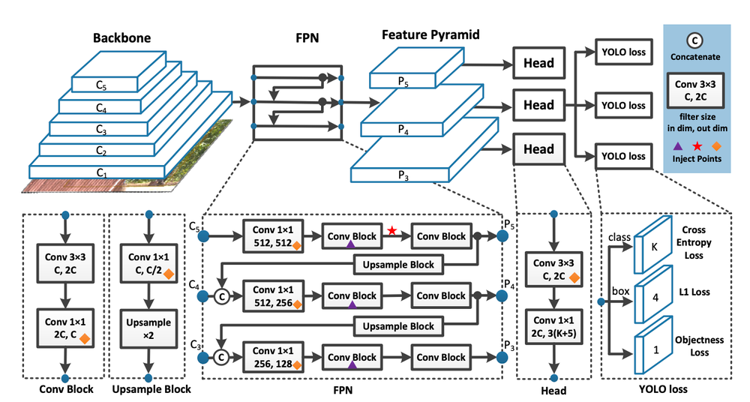
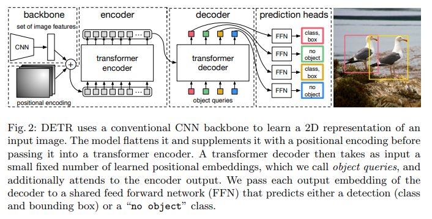

# HW3

Student: LEI WA KIN, R11922001

## Question and Discussion

1. (10 %) Please explain how you implement the `non_max_suppression()` function. And discuss the results of object detection from the 4 sample images. E.g., why some objects are detected and others are not or misclassified. **Please put your 4 output images. We suggest that you use a table for comparison between the images.**

    Here is the code snippet migrate from .ipynb, which is slightly modified for readability. Basically its classic nms, not soft-nms. Greedy select bounding boxes with maximum class confidence from model output, calculate IoU to other candidates, suppress the bounding boxes that have high IoU to current box, repeat these steps until all of the boxes are picked or suppressed.

    ```python
    # Input:
    #   current_prediction - List of tuple (sx, sy, ex, ey, cls_conf, cls)
    #   conf - List of float
    #
    # Output:
    #   ret - filtered prediction
    ret = list()
    while True:
        # check if there is no remain bbox, terminate the loop
        val, idx = conf.max(0)
        if val == 0:
            break

        # push candidate bbox with max confidence to output list
        ret.append(current_prediction[idx].tolist())
        current_prediction[idx, 4] = 0

        # calculate IoU between the candidate bbox and remain bboxes
        # iou.shape: (n, )
        box1 = current_prediction[idx, :4].unsqueeze(0)
        box2 = current_prediction[:, :4]
        iou_mask = (box_iou(box1, box2).squeeze(0)) > iou_thres

        # suppress the conf to 0 if IoU is higher than the threshold
        current_prediction[iou_mask, 4] = 0

    return ret
    ```

    For the demo images, please refer to Appendix.

<p style="page-break-before: always">

2. (10 %) Try to adjust the conf_thres and iou_thres parameters and observe how they affect the final predictions. Provide your observations. (Default: conf_thres=0.4, iou_thres=0.6)

    One of the famous issue in object detection is small object detection. YOLO-series model are likely to miss the small objects in the image because of low confidence.

    

    The another issue is multiple predicted bounding boxes at the local region. User should trade-off between occlusion detection and bounding boxes duplication.

    

<p style="page-break-before: always">

3. (10 %) The methods for object detection can be divided into one-stage and two-stage approaches. What type of object detection method does YOLO belong to? What is the difference between one-stage and two-stage methods, and what are their respective pros and cons?

    YOLO is one-stage object detector. One-stage approach predicts bounding boxes and classify the category of target objects in single model forwarding. On the other hand, two-stage approach proposes many bounding boxes first, then crop the images and do image classification to each bounding box.

    In short, there is trade-off between computation cost and accuracy when you are selecting detection algorithm. One-stage approach is much more computation efficient, thus it is possible to use for real-time object detection. In contrast, the two-stage approach is more accurate than one-stage approach.

4. (10 %) Please draw the architecture of YOLOv7. Explain how each component is designed and its functionality.

    I found a figure from the [blog](https://blog.roboflow.com/yolov7-breakdown/), it clearly shows the architecture of YOLO-series. For YOLO series detectors, the model can be partitioned into 3 parts: backbone, neck and head.

    Backbone is a down-sampler, it utilizes CNN to extract features from input, then pass the features to neck for better feature fusion. Neck aims to fuse the feature obtained from different scale. There are evidence that model cannot detect small objects accurately without leveraging features from shallow layers, thus a consensus to improve YOLO is adding a fuse layer inside the model. The heads aim to predict the tuples of bounding box `(x, y, w, h, obj_conf, cls_conf)`. The experiments show that detecting objects from different scale of features improve the performance, so multi-head architecture is applied.

    

    Base on the high-level architecture, previous studies aimed to fine-tune the implementation of blocks to improve the model performance. In YOLOv7, the authors absorbed the ideas from ResNext, ShuffleNet, etc. to implement the backbone and neck. I think the detailed implementation takes a lot of space. Therefore, just provide a [link](https://www.youtube.com/watch?v=Ot__47ItjDs&ab_channel=WilsonHo) for someone interested to detailed implementation. Worth mentioning that, they have applied some re-parameterization to residual blocks to improve the utilization of memory space and also computation parallelism.

5. (10 %) Please survey one of the other object detection methods (e.g, CNN-based, transformer-based, one-stage or two-stage approaches, other versions of YOLO, etc.) and briefly explain it. Also, compare its pros and cons with YOLOV7.

    DETR is one of the object detection method published at EECV2020 Oral. In this work, the authors proposed to solve the object detection problem with transformer. DERT treats the 2D-features extracted from CNN as visual word, passed through an encoder-decoder to get N embedding, where N is pre-defined parameter controls the maximum number of prediction model can be generated for each input x.

    

    Compare with YOLOv7, The advantages of DETR are that it leverages less human-crafted tricks, makes more parts learning from data. DETR does not applied the technique such as anchor-box, non-maximum suppression. Take "object queries" as example, the queries are learnt from data. Its philosophy is similar to soft-prompting in NLP. DETR has some significant disadvantages to YOLOv7, such as huge computation consumption, training-time consuming, etc.

6. Reference

    1. Nicolas Carion, Franscisco Massa, Gabeiel Synnaeve, Nicolas Usunier, Alexandar Kirillov, and Sergey Zagoruyko, "End-to-End Object Detection with Transformers".

    2. [Jia-Yau Shiau - DETR 的天馬行空: 用 Transformer 走出 Object Detection 簡潔 Pipeline](https://medium.com/ai-blog-tw/detr%E7%9A%84%E5%A4%A9%E9%A6%AC%E8%A1%8C%E7%A9%BA-%E7%94%A8transformer%E8%B5%B0%E5%87%BAobject-detection%E6%96%B0pipeline-a039f69a6d5d)

    3. [Wilson Ho - 圖解 YOLOv7](https://www.youtube.com/watch?v=Ot__47ItjDs&ab_channel=WilsonHo)

    4. [Jacob Solawetz - What is YOLOv7? A Complete Guide.](https://blog.roboflow.com/yolov7-breakdown/)

<p style="page-break-before: always">

## Appendix


