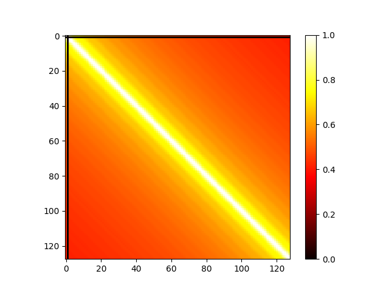
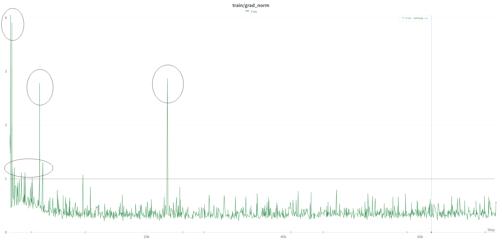

# Report

0. [Question](https://speech.ee.ntu.edu.tw/~hylee/ml/ml2023-course-data/HW05.pdf)

1. Given a (N x D) positional embedding lookup table, you aim to get a (N x N) “similarity matrix” by calculating similarity between different pairs of embeddings in the table. You need to visualize the similarity matrix and briefly explain the result. In this problem, we focus on the positional embeddings of the decoder.

    The following figure visualizes the similarity of positional code (using SinusoidalPositionalEmbedding), which assumes the length of input sequence is 128, and dimension of embedding is 512.

    It shows that the similarity between the embedding of close positions is stronger, which fits the expectation.

    

    Code snippet for visualizing positional embedding is provided below.

    ```python
    import torch
    from torch.nn import functional as F
    from matplotlib import pyplot as plt
    from fairseq.modules import SinusoidalPositionalEmbedding

    # Trace TransformDecoder in fairseq, then find member field
    # self.embed_positions, it initialize a sinusoidal position embedding
    # instance given positional embedding is fixed (not learnable).
    pos = SinusoidalPositionalEmbedding.get_embedding(
        num_embeddings=128, embedding_dim=512, padding_idx=1
    )
    norm = torch.norm(pos, dim=1)

    # similarity = F.cosine_similarity(pos, pos)
    numerator = norm.repeat(128, 1)
    numerator = torch.maximum(numerator * numerator.transpose(0, 1), torch.tensor(1e-8))
    similarity = torch.mm(pos, torch.transpose(pos, 0, 1))
    similarity /= numerator

    plt.imshow(similarity, cmap='hot', interpolation='nearest')
    plt.colorbar()
    plt.show()
    ```

2. Clip gradient norm and visualize the changes of gradient norm in different steps. Circle two places with gradient explosion.

    
