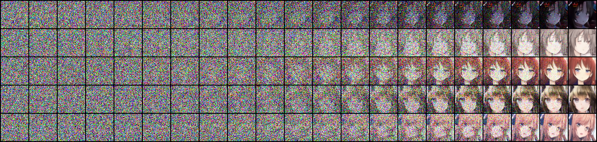

# Report

0. [Question](https://docs.google.com/presentation/d/1x8c38zgEbN2zN4EboWhquZ5b3LhVCN8ElhaJCO2vnzY/edit#slide=id.g2267552461f_0_0)

1. Sample 5 images and show the progressive generation. Then, briefly describe their differences in different time steps.

    These images are generated from linear beta scheduler, total 1000 timesteps, record the intermediates for every 50 iterations. It seems nothing but noise at the first 300 ~ 500 iterations, then something similar to the contour of faces appears, then eyes and mouth.

    

2. Canonical diffusion model (DDPM) is slow during inference, Denoising Diffusion Implicit Model (DDIM) is at least 10 times faster than DDPM during inference, and preserve the qualities. Please describe the differences of training, inference process, and the generated images of the two models respectively. Briefly explain why DDIM is faster.

    - There are no difference between DDPM and DDIM in training process, they both aim to predict the noise add to image.
    - For DDIM, it samples a sub-sequence timesteps $[\tau_1, \dots \tau_S]$ from original timestep sequence $[1, \dots T]$ when doing generative process.
    - The author of DDIM measured the FID scores for both models, they found that DDPM has the best performance when number of timesteps is set as 1000, for cases 10, 20, 50 and 100, DDIM performs better. I submitted a pack of generated images to JudgeBoi, and the following is the performance report. Notes that they shared the same model parameters.

    |      Sampling       |  AFD  |   FID   |
    | :-----------------: | :---: | :-----: |
    | DDIM (S=50, T=1000) | 0.472 | 9172.15 |
    |    DDPM (T=1000)    | 0.542 | 8250.04 |

## Reference

- https://zhuanlan.zhihu.com/p/565698027
- https://arxiv.org/abs/2010.02502
- https://lilianweng.github.io/posts/2021-07-11-diffusion-models/
