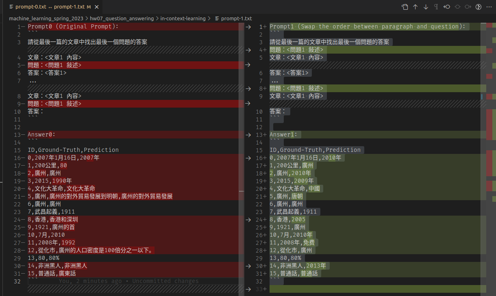
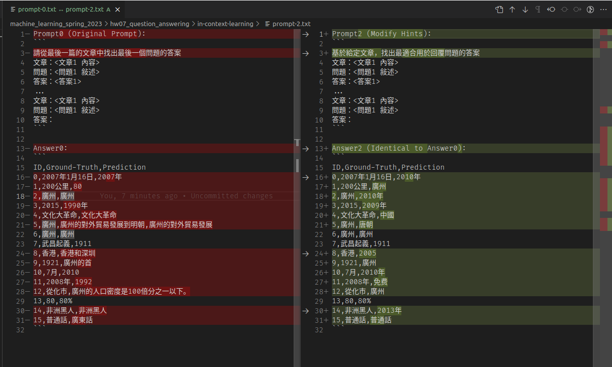
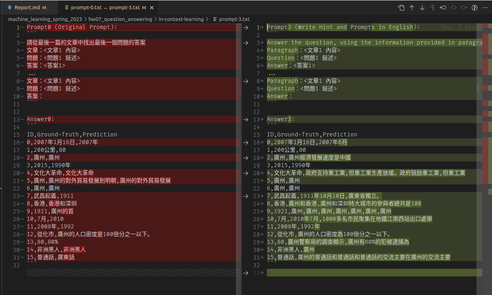
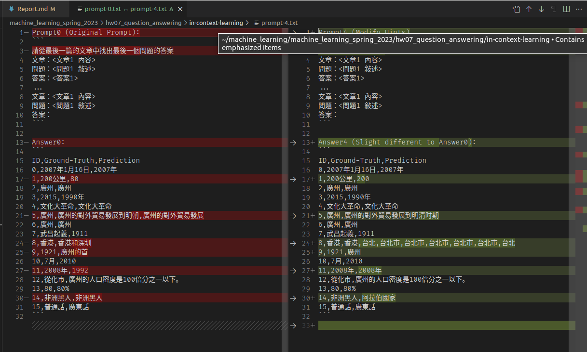
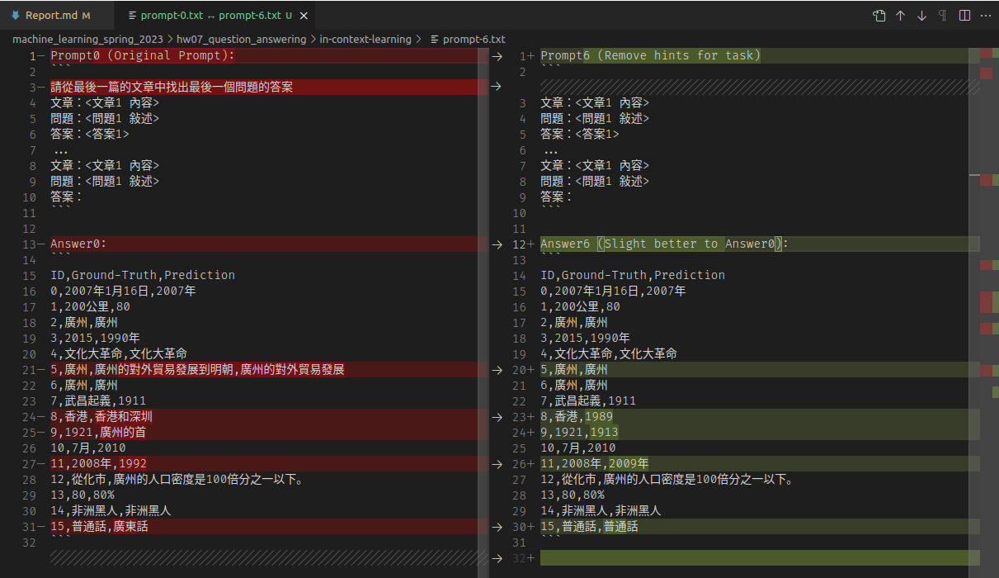
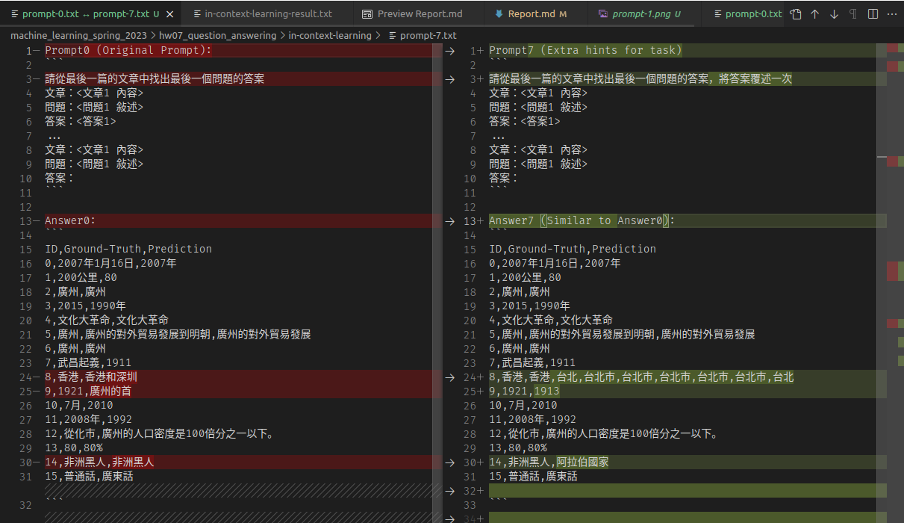

# Report

1. There are some difference between fine-tuning and prompting. Beside fine-tuning, in-context learning enable pre-trained model to give correct prediction on many downstream tasks with a few examples but without gradient descent. Please describe: A. How encoder-only model (Bert-series) determines the answer in a extractive question answering task? B. How decoder-only model (GPT-series) determines the answer in a extractive question answering task?

   BERT-series model needs extra heads to predict whether the answer is in the given context, and also the position (start and end position) of the answer. On the other hand, GPT-series model deal with question answering tasks by conditional text generation, that is, given context and question as prefix, model should generate corresponding texts.

2. The goal of this homework is to fine-tune a QA model. In this question, We wish you to try In-context learning on the same task and compare the difference between the prediction of in-context learning and fine-tuning. A. Try to Instruct the model with different prompts, and describe your observation on at least 3 pairs of prompts comparison. B. Paste the screenshot of your prediction file in A. to Gradescope. (There are at least 6 screenshots)

   Model: XGLM-1.7B

   K (Examples for few-shot learning): 4

   Comparison 1: Swap the order of passage and question.
      => Worst than original one, the answer is uninformative.
      

   Comparison 2: Paraphrase
      => Worst than original one. Seems the model does not understand the question, and randomly pick some numbers like years to me.
      

   Comparison 3: Prompting with English, the context is kept as Chinese
      => Significantly generating nonsense words...
      

   Comparison 4: Add keyword "閱讀理解" to hint
      => Similar or slightly reasonable answers.
      

   Comparison 5: Remove the hint (instruction), only examples are provided
      => Similar or slightly reasonable answers. Seems not too bad.
      

   Comparison 6: Add keyword "將答案覆述一次​" to hint
      => Similar answers. Not significantly better than before.
      
